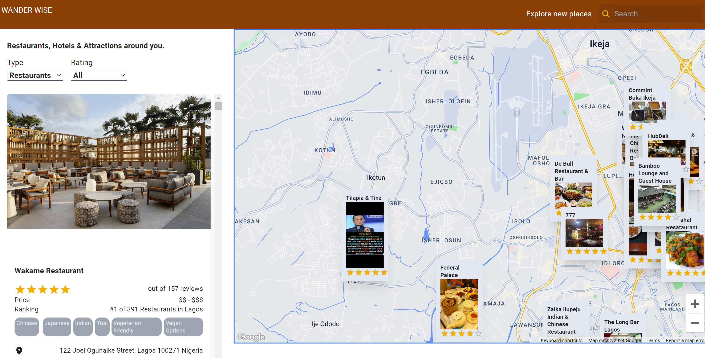

# WANDER WISE

Wander Wise is a sophisticated travel companion application that leverages the power of Google Maps to enhance users' travel experiences. The app integrates advanced geolocation features, allowing users to pinpoint their location and navigate their surroundings effortlessly. By harnessing the Google Maps API, Wander Wise provides seamless searching for places and destinations, offering users instant access to nearby restaurants, hotels, and attractions. The application utilizes specialized Rapid APIs to fetch detailed data about local amenities, ensuring users receive tailored recommendations based on their preferences and location.

With Wander Wise, users can filter through a variety of data, making it easy to find precisely what they're looking for, whether it's a top-rated restaurant, a comfortable hotel, or a popular tourist attraction. The app is built with a modern tech stack including React, Tailwind CSS, and Material-UI for a sleek, intuitive user interface. Combined with the robust capabilities of the Google Maps API and Rapid API's TripAdvisor integration, Wander Wise offers a comprehensive and user-friendly travel tool that caters to all types of explorers.

## Examples

Try out the demo here:https://wander-wisee.netlify.app/

## Tech Stack

| Type      | Tech                                                                      |
| --------- | ------------------------------------------------------------------------- |
| Language  | [JavaScript](https://www.javascript.com/)                                 |
| Framework | [React](https://react.dev/)                                               |
| Styling   | [Tailwind CSS](https://tailwindcss.com/)                                  |
| Styling   | [Material-UI](https://mui.com/)                                           |
| API       | [RapidAPI (TripAdvisor)](https://rapidapi.com/apidojo/api/travel-advisor) |
| API       | [GOOGLE MAPS API](https://console.cloud.google.com)                       |
| Hosting   | [Netlify](https://netlify.com)                                            |
